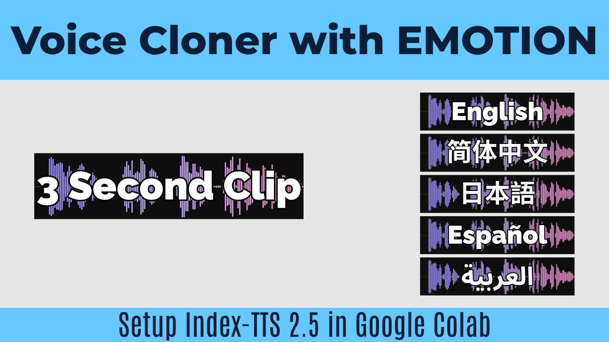

# 🎶 Demucs in Google Colab: Free Vocal & Stem Separation

This repository contains an easy-to-use Google Colab notebook for running **Demucs**. This AI tool allows you to isolate vocals, drums, bass, and other instruments from any audio or video file for free using a Google Colab T4 GPU. 

**🎥 Watch the Tutorial:** [Setup Demucs in Google Colab](https://www.youtube.com/watch?v=NmrpLYrdN4Q)

**🚀 Run in Colab:** [Open Google Colab Notebook](https://colab.research.google.com/drive/1gG508q-vuZwV5SF50ErFbw7tRTYHXfc7?usp=sharing)

---

## ✨ Features Supported in this Notebook

This notebook makes it incredibly simple to use Demucs through an interactive UI:

* **Media Support:** Upload audio (`.mp3`, `.wav`, `.flac`, etc.) or video files (`.mp4`, `.mkv`, `.mov`, etc.) directly. The tool automatically extracts the audio track from videos.
* **Multiple Models:** Choose between `htdemucs`, `htdemucs_ft`, `htdemucs_6s`, and `mdx_extra`.
* **Separation Modes:** Extract 2 stems (e.g., Vocals + Instrumental), 4 stems, or up to 6 stems (Vocals, Drums, Bass, Other, Guitar, Piano).
* **Audio Output Settings:** Export as `mp3`, `wav`, or `flac` with adjustable bitrates. 
* **Volume Boost:** A built-in slider (0-20 dB) allows you to automatically boost quiet background/instrumental tracks.
* **Automatic Zipping:** Packages all your separated stems into a `.zip` file and downloads it automatically.

## 🛠️ How to Use

1. Click the "Open in Colab" badge above.
2. Go to **Runtime > Change runtime type** and ensure a **T4 GPU** is selected.
3. **Step 1:** Click the play button on **Cell 1** to install Demucs, set up FFmpeg, and check your GPU status.
4. **Step 2:** Scroll to **Cell 2** and choose your settings (Model, Separation Mode, Output Format, etc.).
5. Click the play button on **Cell 2**. A button will appear asking you to upload your files.
6. The AI will extract the audio, separate the stems, and display audio players so you can preview the results immediately! Finally, it will automatically download your tracks in a ZIP file.

## 🤝 Credits
* **Tutorial & Notebook Creator:** [@CoinNoin](https://www.youtube.com/@CoinNoin)
* **Underlying AI Model:** [Facebook Research / Demucs](https://github.com/facebookresearch/demucs)
